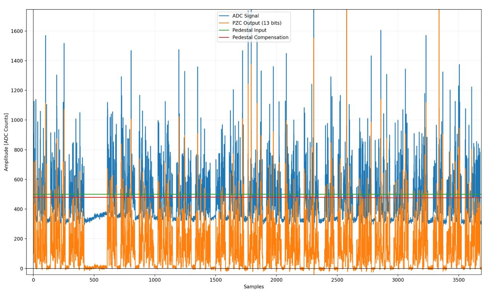

# Shaper FENICS FPGA

Diretório usado para armazenar os arquivos em `Verilog` e arquivos de análise extras do simulador de pulsos do TileCal.

## 🗂️ verilog_src
Pasta com todos os .v utilizados no projeto, desenvolvidos com auxílio do Vivado.

## Arquivos auxiliares

- `iladata.csv`
  Captura exportada do ILA usada para inspeção dos sinais no Python.

- `simul_data.py`
Script usado para ler e plotar os sinais provenientes da ILA, fornecidos em csv.

- `tf_shaper.m`
Script usado para obter os coeficientes do shaper, no domínio s e z.

  

